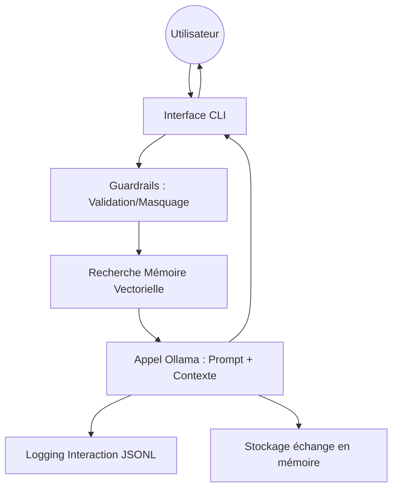

# Architecture du Système

Atlas AI est un assistant basé sur une architecture RAG (Retrieval-Augmented Generation) locale, intégrant des mécanismes de contrôle (Guardrails) et d'observabilité.

## Vue d'ensemble

L'application est découpée en composants modulaires :
- **CLI** : Interface utilisateur riche (Rich/Typer).
- **LLM Engine** : Interface avec Ollama.
- **Memory Engine** : Base de données vectorielle (ChromaDB).
- **Guardrails** : Système de sécurité et de filtrage.
- **Monitoring** : Système de traces structurées (JSONL).

## Flux de données

Le diagramme suivant illustre le cheminement d'une requête utilisateur :

## Composants Clés

### 1. Mémoire Vectorielle (ChromaDB)
Utilise `chromadb` pour stocker et rechercher des souvenirs pertinents. Les échanges sont résumés et indexés par mots-clés pour optimiser la pertinence du contexte injecté.

### 2. Guardrails
Intercepte les messages pour :
- Masquer les PII (Données Personnelles).
- Bloquer les sujets hors périmètre (Politique, Religion).
- Détecter les tentatives d'injection de prompt.

### 3. Monitoring
Chaque appel LLM est décoré par un système de trace qui enregistre :
- Latence
- Consommation de tokens
- Métadonnées de session
- Déclenchement des guardrails

### Modelfile vs Configuration YAML
Bien qu'un `Modelfile` soit fourni pour créer une image de référence `atlas` dans Ollama, l'application utilise prioritairement `config/atlas.yaml`. Cela permet d'injecter dynamiquement le contexte de la mémoire vectorielle dans le prompt système, offrant une plus grande souplesse que les paramètres figés d'un modèle.
